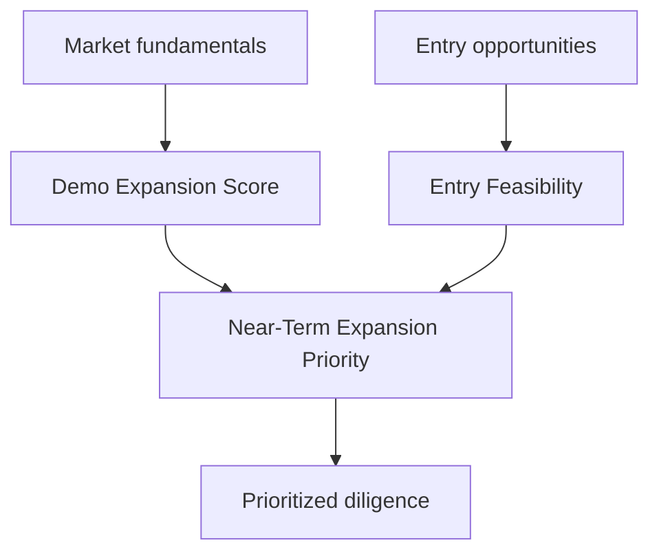
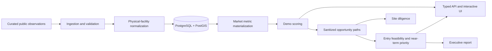
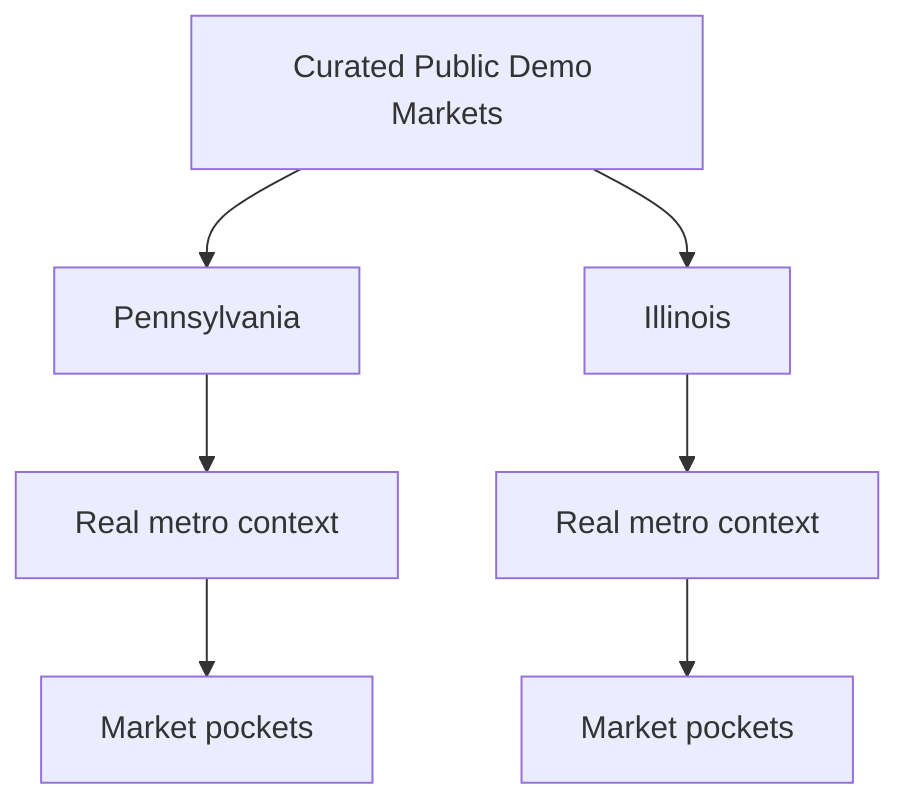

# Urgent Care Expansion Intelligence - Public Demo

This repository is a public portfolio demonstration of a geospatial healthcare expansion intelligence platform. It combines a curated set of real U.S. market geographies and public observations with simplified entry scenarios to identify markets that are both attractive and actionable.

> The markets and underlying public facts are real. All scores are illustrative demo outputs. Production scoring, private opportunity intelligence, source credentials, and proprietary evidence weighting are intentionally excluded.

## The Problem

Healthcare expansion decisions require more than a population map. Teams need to compare demographics, growth, competitive environment, healthcare access, provider conditions, employment activity, and realistic entry paths. Isolated metrics do not answer whether a market is both structurally attractive and practical to enter.

This demo separates those questions:

- Where is the market attractive?
- How feasible is entry?
- Where should expansion diligence happen first?

## What This Project Demonstrates

    market intelligence
    + geospatial analysis
    + data engineering
    + decision modeling
    + acquisition intelligence
    + executive reporting

The implementation includes deterministic public-data ingestion, PostGIS ZCTA geometry, typed APIs, a pocket-first interactive map, curated competitor context, clearly labeled opportunity evidence, versioned demo scoring, tests, and a sample executive Word report.

## Decision Framework

### Market Attractiveness

Demo Expansion Score answers: Is this market structurally attractive?

### Entry Feasibility

Demo Acquisition / Entry Feasibility answers: Is there a plausible near-term way to enter through a listed acquisition, illustrative off-market target, or real-estate path?

### Near-Term Expansion Priority

The combined score answers: Where should diligence happen first?

## Architecture

The application defaults to its deterministic curated dataset for a zero-configuration UI preview. Setting `DEMO_DATA_MODE=database` routes the same typed API through PostgreSQL/PostGIS after migration and ingestion.

## Data Model

The hierarchy is Region to State to Metro to Market Pocket. Metros remain useful context and filter dimensions, while the primary map renders pockets directly.

## Curated Public Dataset

The deterministic seed contains nine real ZIP Code Tabulation Area markets:

- State College, Royersford/Limerick, Lancaster, East York, North Harrisburg, and South Erie in Pennsylvania
- Hoffman Estates, Schaumburg, and Arlington Heights in Illinois
- 2020 Census TIGERweb ZCTA geometry
- 2024 ACS population, employment, and health-insurance observations
- 2019-to-2024 ACS population change
- a small curated public competitor snapshot
- one real public Hoffman Estates healthcare-practice listing
- sanitized or illustrative off-market and real-estate scenarios

The application labels each field as a real public observation, a derived public observation, or an illustrative demo value. It is a curated portfolio, not complete national coverage. No production records or private targets are included.

Public market observations are grounded in official public-source geography and data. The map's circular overlays represent the curated five-mile market analysis areas used for this demonstration rather than literal ZIP-code boundaries. Canonical Census ZCTA geometry remains stored for lineage, demographic analysis, ZIP routing, and reproducibility.

## Analytics

The public model identifier is `demo_expansion_score_v2`. It mirrors the business concepts and product architecture of the private production platform, but uses independently configured illustrative weights, simplified normalization, curated public observations, and sanitized opportunity scenarios. It does not reproduce production rankings or proprietary acquisition intelligence.

| Component | Illustrative weight |
| --- | ---: |
| Population | 15% |
| Population Growth | 20% |
| Competitors / 10k Population | 20% |
| Competitor Strength | 10% |
| Competitive Availability Gap | 10% |
| Clinical Workforce Growth | 5% |
| Occupational Medicine Potential | 10% |
| Primary-Care Underserved | 10% |

Raw observations are min-max normalized across the nine curated markets with explicit directionality. Public, derived, and illustrative values remain labeled. Demo v1 remains historical; demo v2 does not reproduce production normalization, weights, thresholds, or ranking logic. Full details are in [docs/methodology.md](docs/methodology.md).

Competitive saturation includes the qualitative display:

| Signal | Interpretation |
| --- | --- |
| ++ | Highly favorable |
| + | Favorable |
| ○ | Neutral |
| - | Unfavorable |
| -- | Highly unfavorable |

## Opportunity Intelligence

The demo presents four entry-path categories:

- Listed acquisition
- Sanitized illustrative off-market target
- Sanitized illustrative occupational-medicine target
- Real-estate entry

Hoffman Estates includes a linked public listing snapshot verified August 25, 2026. Royersford uses sanitized off-market and occupational-medicine examples that do not identify private targets and are not predictions that an owner will sell. Standalone occupational medicine is represented as a strategic opportunity type, not an urgent-care competitor.

The entry score is strongest-path oriented with a small breadth bonus. Near-Term Expansion Priority uses a simple geometric combination so a serious weakness in attractiveness or feasibility reduces priority. Neither formula reproduces private production logic.

## Interactive Experience

The primary map:

- displays all qualifying demo pockets directly
- filters by real state and metro context
- defaults to Immediate Review and Strong near-term markets
- defaults to prominent blue circular market-analysis areas, with active public listings in violet
- can explicitly switch to Near-Term Priority or Expansion Score coloring
- ranks visible pockets beside the map
- opens a market overview and navigates to full detail

Market detail includes Overview, Competitors, Opportunities, and Notes. The Overview centers the eight-component six-column score breakdown. Source links remain attached to relevant fields; methodology lives in this README and [docs/methodology.md](docs/methodology.md).

## Screenshots

### Curated market analysis areas

### Market overview

### Competitor intelligence

### Opportunity paths

### Notes and source lineage

See [docs/screenshots/README.md](docs/screenshots/README.md) for capture conventions.

## Engineering Highlights

- PostGIS geometry storage and spatial indexing
- deterministic, idempotent curated-data ingestion
- Zod validation at the ingestion boundary
- versioned and testable demo scoring
- conservative physical-facility identity with synthetic alias tests
- purpose-aware separation of urgent-care competitors and occupational-medicine targets
- typed Next.js APIs
- circle-first Leaflet market visualization with retained PostGIS source geometry
- TanStack competitor table
- evidence lineage and confidence
- deterministic Word reporting
- site traffic represented only as downstream opportunity diligence
- Docker-based local database
- Vitest and TypeScript validation

## Three-Layer Strategy

### Layer 1 - Private production

The private production repository contains real ingestion, full scoring, opportunity intelligence, operational QA, and production reporting. None of that private data or proprietary logic is included here.

### Layer 2 - Public technical demo

This repository contains curated public observations, simplified scoring, generic interfaces, PostGIS, Next.js, interactive market exploration, tests, and a public-demo report.

### Layer 3 - Public case study

This README and the docs directory explain the business problem, architecture, analytical framework, engineering decisions, and lessons without exposing private implementation details.

## Repository Boundaries

> This repository is a sanitized technical demonstration. It uses real public facts with simplified analytical models. Production datasets, private targets, credentials, scoring weights, opportunity-search strategies, and proprietary decision logic are intentionally excluded.

The demo is public for portfolio visibility. No open-source license is granted.

## Running Locally

Prerequisites: Node.js 20+, npm, Docker Desktop, and Git.

    git clone https://github.com/jdgoetz/urgent-care-expansion-demo.git
    cd urgent-care-expansion-demo
    npm.cmd install
    docker compose up -d --wait
    copy .env.example .env.local
    npm.cmd run db:migrate
    npm.cmd run ingest:demo
    npm.cmd run dev

Open http://localhost:3000/map.

For a UI-only preview without PostgreSQL, omit `.env.local` and run `npm.cmd run dev`. The typed API will use the same deterministic curated dataset in memory.

## Tests

    npm.cmd test
    npm.cmd run typecheck
    npm.cmd run db:check
    npm.cmd run check:modes

Run db:check after starting PostGIS, applying migrations, and ingesting demo data.

## Curated Public Word Report

Install the optional Python report dependency and generate the sample:

    python -m pip install -r reporting/requirements.txt
    npm.cmd run report:demo
    npm.cmd run test:reporting

Routine report output is ignored. A curated public sample is retained under `docs/sample` for this case study.

## Documentation

- [Architecture](docs/architecture.md)
- [Methodology](docs/methodology.md)
- [Screenshot guide](docs/screenshots/README.md)
- [Contributing](CONTRIBUTING.md)
