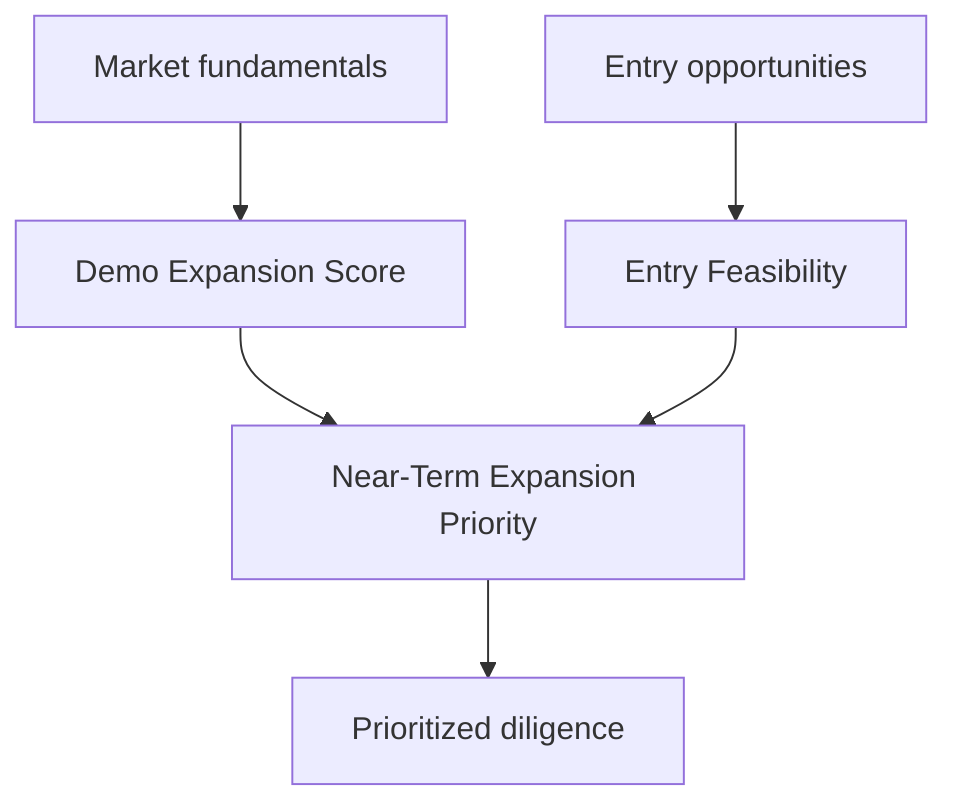
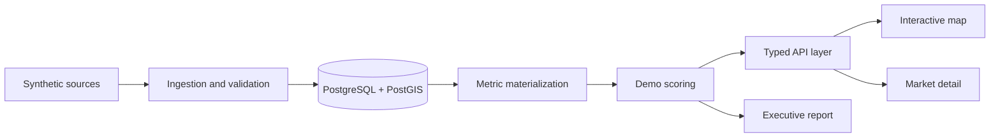
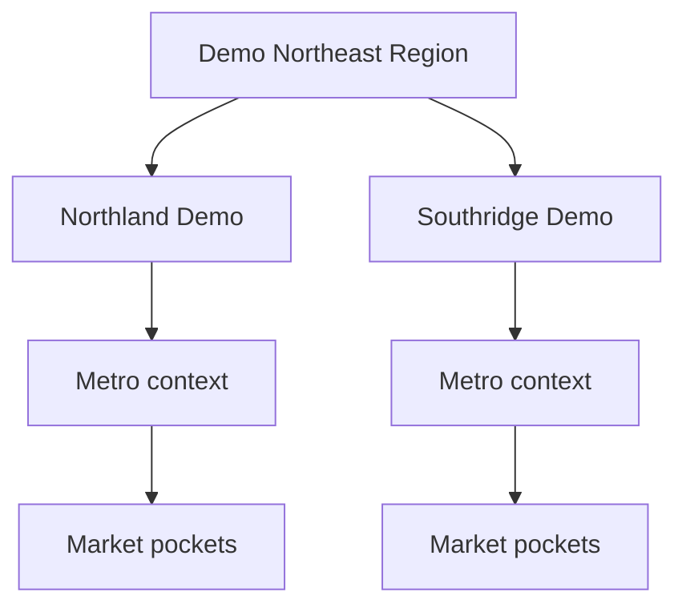
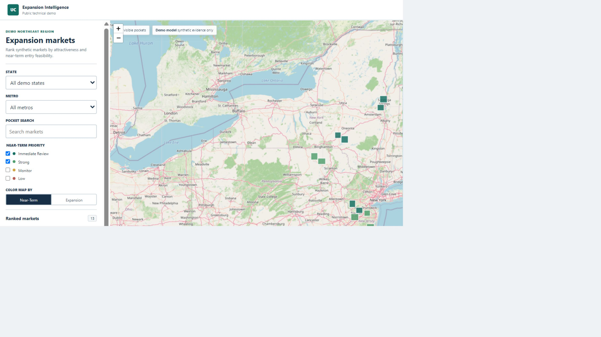
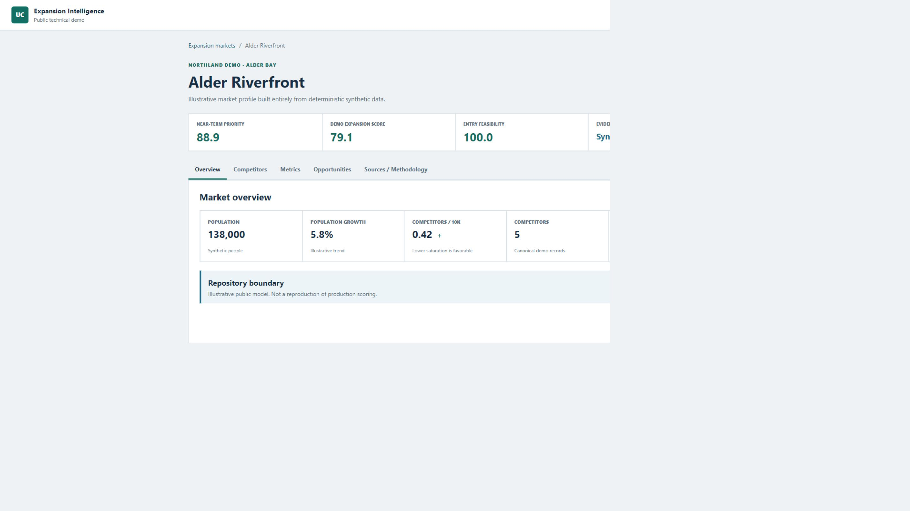
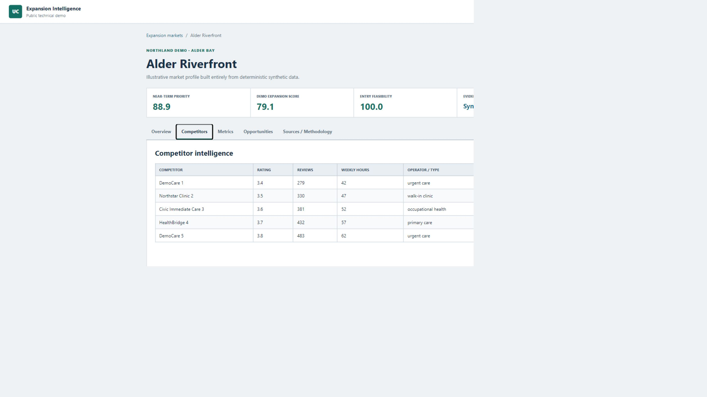
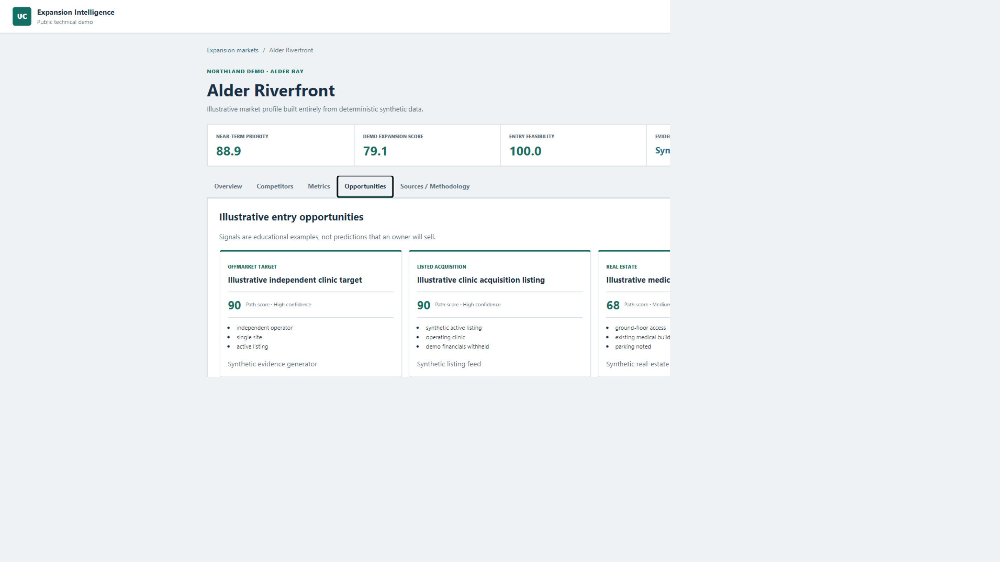
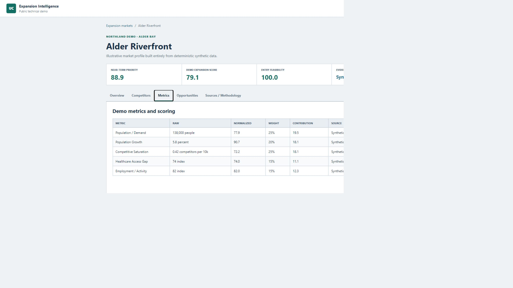
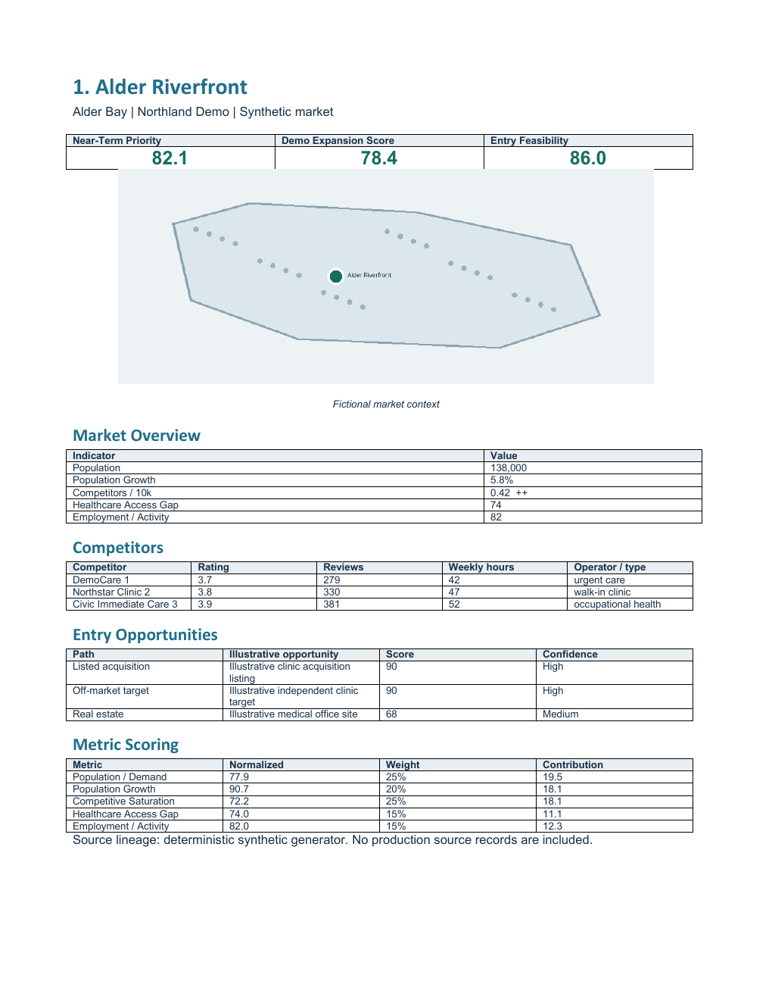

# Urgent Care Expansion Intelligence - Public Demo

This repository is a sanitized technical demonstration of a geospatial healthcare expansion intelligence platform. It combines synthetic market fundamentals, competitive saturation, healthcare access conditions, and illustrative entry opportunities to identify markets that are both attractive and actionable.

> All locations, organizations, competitors, opportunities, and evidence in this repository are fictional. The analytical models are intentionally simplified and do not reproduce private production logic.

## The Problem

Healthcare expansion decisions require more than a population map. Teams need to compare demographics, growth, competitive environment, healthcare access, provider conditions, employment activity, and realistic entry paths. Isolated metrics do not answer whether a market is both structurally attractive and practical to enter.

This demo separates those questions:

- Where is the market attractive?
- How feasible is entry?
- Where should expansion diligence happen first?

## What This Project Demonstrates

    market intelligence
    + geospatial analysis
    + data engineering
    + decision modeling
    + acquisition intelligence
    + executive reporting

The implementation includes a deterministic synthetic ingestion pipeline, PostGIS pocket geometry, typed APIs, a pocket-first interactive map, competitor intelligence, illustrative opportunity evidence, versioned demo scoring, tests, and a sample executive Word report.

## Decision Framework

### Market Attractiveness

Demo Expansion Score answers: Is this market structurally attractive?

### Entry Feasibility

Demo Acquisition / Entry Feasibility answers: Is there a plausible near-term way to enter through a listed acquisition, illustrative off-market target, or real-estate path?

### Near-Term Expansion Priority

The combined score answers: Where should diligence happen first?

## Architecture

The application defaults to its deterministic in-process dataset for a zero-configuration UI preview. Setting DEMO_DATA_MODE to database routes the same typed API through PostgreSQL/PostGIS after migration and ingestion.

## Data Model

The hierarchy is Region to State to Metro to Market Pocket. Metros remain useful context and filter dimensions, while the primary map renders pockets directly.

## Synthetic Dataset

The deterministic seed contains:

- 1 fictional region
- 2 fictional states
- 5 fictional metros
- 18 fictional market pockets
- synthetic demographics, growth, access, activity, and competitor saturation
- synthetic competitor records with ratings, reviews, weekly hours, categories, and safe example links
- synthetic listed acquisitions, off-market signals, and medical real-estate paths

No production records or external provider responses are included.

## Analytics

The public model identifier is demo_expansion_score_v1.

| Component | Illustrative weight |
| --- | ---: |
| Population / Demand | 25% |
| Population Growth | 20% |
| Competitive Saturation | 25% |
| Healthcare Access Gap | 15% |
| Employment / Activity | 15% |

The public demo uses simplified illustrative scoring and does not reproduce the production model. Full details are in [docs/methodology.md](docs/methodology.md).

Competitive saturation includes the qualitative display:

| Signal | Interpretation |
| --- | --- |
| ++ | Highly favorable |
| + | Favorable |
| ○ | Neutral |
| - | Unfavorable |
| -- | Highly unfavorable |

## Opportunity Intelligence

The demo models three entry paths:

- Listed acquisition
- Illustrative off-market target
- Real-estate entry

Signals such as independent operator, single site, limited hours, active listing, institutional ownership, and recent acquisition use obvious demo-only weights. They support evidence-based workflow demonstrations and are not predictions that an owner will sell.

The entry score is strongest-path oriented with a small breadth bonus. Near-Term Expansion Priority uses a simple geometric combination so a serious weakness in attractiveness or feasibility reduces priority. Neither formula reproduces private production logic.

## Interactive Experience

The primary map:

- displays all qualifying demo pockets directly
- filters by fictional state and metro
- defaults to Immediate Review and Strong near-term markets
- switches color between Near-Term Priority and Expansion Score
- ranks visible pockets beside the map
- opens a market overview and navigates to full detail

Market detail includes Overview, Competitors, Metrics, Opportunities, and Sources / Methodology.

## Screenshots

### Pocket-first regional map

### Market overview

### Competitor intelligence

### Opportunity paths

### Metrics and scoring

### Synthetic executive report

See [docs/screenshots/README.md](docs/screenshots/README.md) for capture conventions.

## Engineering Highlights

- PostGIS geometry storage and spatial indexing
- deterministic, idempotent synthetic ingestion
- Zod validation at the ingestion boundary
- versioned and testable demo scoring
- typed Next.js APIs
- pocket-first Leaflet visualization
- TanStack competitor table
- evidence lineage and confidence
- deterministic Word reporting
- Docker-based local database
- Vitest and TypeScript validation

## Three-Layer Strategy

### Layer 1 - Private production

The private production repository contains real ingestion, full scoring, opportunity intelligence, operational QA, and production reporting. None of that private data or proprietary logic is included here.

### Layer 2 - Public technical demo

This repository contains synthetic data, simplified scoring, generic interfaces, PostGIS, Next.js, interactive market exploration, tests, and a synthetic report.

### Layer 3 - Public case study

This README and the docs directory explain the business problem, architecture, analytical framework, engineering decisions, and lessons without exposing private implementation details.

## Repository Boundaries

> This repository is a sanitized technical demonstration. It uses synthetic data and simplified analytical models. Production datasets, targets, credentials, scoring weights, opportunity-search strategies, and proprietary decision logic are intentionally excluded.

The demo is public for portfolio visibility. No open-source license is granted.

## Running Locally

Prerequisites: Node.js 20+, npm, Docker Desktop, and Git.

    git clone https://github.com/jdgoetz/urgent-care-expansion-demo.git
    cd urgent-care-expansion-demo
    npm.cmd install
    docker compose up -d
    copy .env.example .env.local
    npm.cmd run db:migrate
    npm.cmd run ingest:demo
    npm.cmd run dev

Open http://localhost:3000/map.

For a UI-only preview without PostgreSQL, omit .env.local and run npm.cmd run dev. The typed API will use the same deterministic synthetic dataset in memory.

## Tests

    npm.cmd test
    npm.cmd run typecheck
    npm.cmd run db:check

Run db:check after starting PostGIS, applying migrations, and ingesting demo data.

## Synthetic Word Report

Install the optional Python report dependency and generate the sample:

    python -m pip install -r reporting/requirements.txt
    python reporting/generate_demo_report.py

Routine report output is ignored. A curated synthetic sample is retained under docs/sample for this case study.

## Documentation

- [Architecture](docs/architecture.md)
- [Methodology](docs/methodology.md)
- [Screenshot guide](docs/screenshots/README.md)
- [Contributing](CONTRIBUTING.md)

