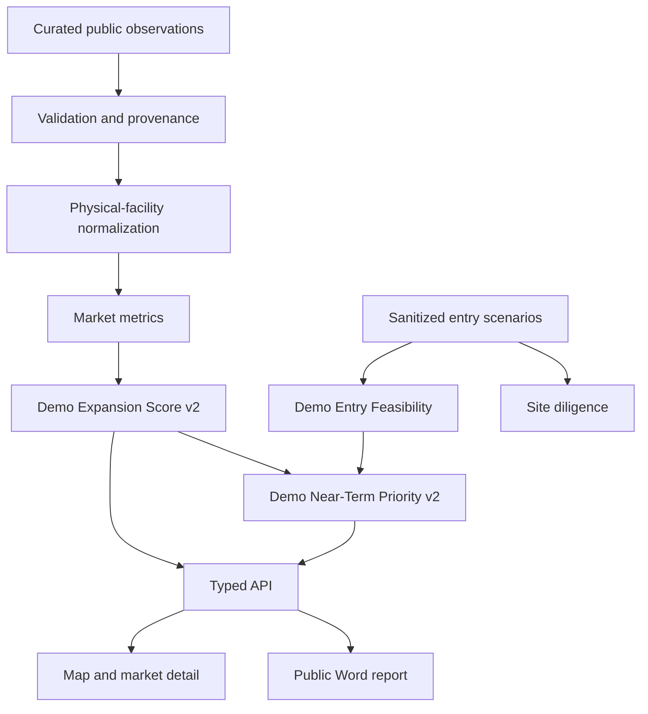

# Architecture

## Runtime flow

Curated market specifications combine labeled public and illustrative observations with official Census TIGERweb ZCTA geometry and explicit five-mile display radii. Zod validates the records before the idempotent ingestion job upserts one region, two states, seven metro contexts, and nine markets into PostgreSQL/PostGIS.

The same typed repository supports two modes:

- default zero-configuration mode serves deterministic in-memory objects;
- `DEMO_DATA_MODE=database` reads equivalent objects from PostgreSQL/PostGIS after migration and ingestion.

The React interface renders markets directly. Metro remains a filter and reporting dimension rather than mandatory navigation.

## Facility and opportunity boundaries

Source/provider profile identity is separate from physical clinic identity. Synthetic tests demonstrate practitioner aliases resolving to one named canonical clinic while unrelated colocated practices remain separate. The curated competitor table contains physical strict general urgent-care facilities only.

Standalone occupational medicine is modeled as a sanitized strategic opportunity type, not strict competition. Site traffic sits downstream as opportunity diligence and never contributes to Demo Expansion Score v2.

## Repository boundaries

- `data/public` contains curated public observations, public source references, official ZCTA geometry, and sanitized scenarios.
- `lib/facilities` contains a conservative public-safe identity example with synthetic tests.
- `lib/scoring` contains independently configured illustrative models.
- `ingestion/demo` validates and persists deterministic public-demo records.
- `lib/server` isolates database access behind the same API shape used by preview mode.
- `components` contains the four-tab decision UI.
- `reporting` creates a deterministic public executive sample.

No private database export, source response, acquisition target, evidence excerpt, run identifier, scoring calibration, production weight, ranking, report payload, or credential is included.
